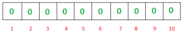
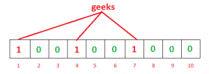
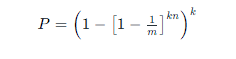
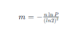

# Bloom Filter

A Bloom filter is a space-efficient probabilistic data structure used to test whether an element is a member of a set. For example, checking the availability of a username is a set membership problem, where the set is the list of all registered usernames. The price we pay for efficiency is that it is probabilistic in nature, meaning there might be some false positive results. A false positive means it might tell you that a given username is already taken when it actually is not.

## Interesting Properties of Bloom Filters

- Unlike a standard hash table, a Bloom filter of a fixed size can represent a set with an arbitrarily large number of elements.
- Adding an element never fails. However, the false positive rate increases steadily as elements are added until all bits in the filter are set to 1, at which point all queries yield a positive result.
- Bloom filters never generate false negative results, i.e., telling you that a username doesn’t exist when it actually exists.
- Deleting elements from the filter is not possible because if we delete a single element by clearing bits at indices generated by k hash functions, it might cause the deletion of a few other elements. For example, if we delete “geeks” by clearing bits at indices 1, 4, and 7, we might end up deleting “nerd” as well because the bit at index 4 becomes 0, and the Bloom filter claims that “nerd” is not present.

## Working of Bloom Filter

An empty Bloom filter is a bit array of m bits, all set to zero, like this:



We need k number of hash functions to calculate the hashes for a given input. When we want to add an item to the filter, the bits at k indices h1(x), h2(x), ... hk(x) are set, where indices are calculated using hash functions.

### Example

Suppose we want to enter “geeks” in the filter, we are using 3 hash functions and a bit array of length 10, all set to 0 initially. First, we’ll calculate the hashes as follows:
```
h1(“geeks”) % 10 = 1
h2(“geeks”) % 10 = 4
h3(“geeks”) % 10 = 7
```
Now we will set the bits at indices 1, 4, and 7 to 1:



Now if we want to check if “geeks” is present in the filter or not, we’ll do the same process but in reverse order. We calculate the respective hashes using h1, h2, and h3 and check if all these indices are set to 1 in the bit array. If all the bits are set, then we can say that “geeks” is probably present. If any of the bits at these indices are 0, then “geeks” is definitely not present.

## False Positive in Bloom Filters

The question is why we said “probably present”, why this uncertainty. Let’s understand this with an example. Suppose we want to check whether “cat” is present or not. We’ll calculate hashes using h1, h2, and h3:
```
h1(“cat”) % 10 = 1
h2(“cat”) % 10 = 3
h3(“cat”) % 10 = 7
```
If we check the bit array, bits at these indices are set to 1, but we know that “cat” was never added to the filter. Bit at index 1 and 7 was set when we added “geeks” and bit 3 was set when we added “nerd”.

So, because bits at calculated indices are already set by some other item, the Bloom filter erroneously claims that “cat” is present, generating a false positive result. Depending on the application, it could be a huge downside or relatively okay.

We can control the probability of getting a false positive by controlling the size of the Bloom filter. More space means fewer false positives. If we want to decrease the probability of a false positive result, we have to use more hash functions and a larger bit array. This would add latency in addition to the item and checking membership.

## Operations Supported by a Bloom Filter

- **insert(x)**: To insert an element in the Bloom Filter.
- **lookup(x)**: To check whether an element is already present in the Bloom Filter with a positive false probability.

**Note**: We cannot delete an element in the Bloom Filter.

## Probability of False Positivity

Let m be the size of the bit array, k be the number of hash functions, and n be the number of expected elements to be inserted in the filter. The probability of a false positive p can be calculated as:



## Size of Bit Array

If the expected number of elements n is known and the desired false positive probability is p, then the size of the bit array m can be calculated as:



## Optimum Number of Hash Functions

The number of hash functions k must be a positive integer. If m is the size of the bit array and n is the number of elements to be inserted, then k can be calculated as:


## Space Efficiency

If we want to store a large list of items in a set for the purpose of set membership, we can store it in a hashmap, tries, or a simple array or linked list. All these methods require storing the item itself, which is not very memory efficient. For example, if we want to store “geeks” in a hashmap, we have to store the actual string “geeks” as a key-value pair {some_key: “geeks”}.

Bloom filters do not store the data item at all. As we have seen, they use a bit array which allows hash collision. Without hash collision, it would not be compact.

## Choice of Hash Function

The hash function used in Bloom filters should be independent and uniformly distributed. They should be as fast as possible. Fast simple non-cryptographic hashes which are independent enough include Murmur, FNV series of hash functions, and Jenkins hashes.

Generating a hash is a major operation in Bloom filters. Cryptographic hash functions provide stability and guarantee but are expensive in calculation. With an increase in the number of hash functions k, the Bloom filter becomes slow. Although non-cryptographic hash functions do not provide a guarantee, they provide major performance improvement.